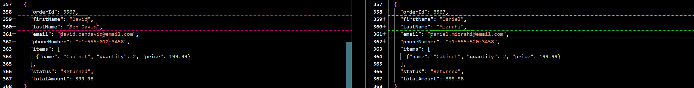

## Chapter 1 – Customer Order Dataset
Prompt used: "Generate 15 customer orders with fields: orderId, customerName, status (Pending, Shipped, Cancelled), and totalAmount. Return as JSON array."
Observations:
- IDs look too mocked for me. A pattern like this ORD-001 doesn't look like a real product pattern.
- From one point of view, status distribution is roughly balanced. From another one, it seems more real. In the real product, most of the orders will be Shipped, small banch of orders will be Cancelled. 7 Shipped, 5 Pending, 3 Cancelled
- totalAmount is an integer without currency
## Chapter 2 – Data Variety and Extended Schema
Prompt used:
  "
  Generate 30 customer orders including realistic edge cases.
Each order should have:
- orderId (integer, range 1–9999)
- firstName (diverse cultural names transliterated into English, without special signs)
- lastName (diverse cultural names transliterated into English, without special signs)
- email (a realistic address that matches the customer name pattern).
- phoneNumber (a phone number string using a consistent pattern such as +0-000-000-0001.)
- items (an array of objects (name, quantity, price) describing purchased products. Item fields should be populated with realistic values)
- status (one of: Pending, Shipped, Cancelled, Returned, On Hold, Payment Error)
- totalAmount (range 0–10,000; include one zero value, one negative value and one very large number)
All statuses must appear at least once in the data set.
Apply the Payment Error status only to the order with a negative total.
Add a small set of invalid entries (missing fields or wrong data types).
Return the result as a JSON array.
  "

Dataset Summary:

- 30 orders with realistic customer names from diverse cultural backgrounds
All 6 statuses represented: Shipped (6), Pending (6), Cancelled (4), Returned (4), On Hold (3), Payment Error (1)
- Edge cases included:
    - Order 20: totalAmount = 0 (free item)
    - Order 7: totalAmount = -49.99 with Payment Error status
    - Order 22: totalAmount = 9899.99 (very large amount)
- 3 invalid entries for validation testing:
    - Order 9234: Missing email; items field is string instead of array; totalAmount is string
    - Order 9234 (Erik): Missing totalAmount field
    - Order 3 (Lucia): Missing orderId field
- Realistic items with quantity and price for each order
- Consistent phone format: +1-555-XXX-XXXX
- Email addresses follow the pattern firstname.lastname@email.com

Observations:
  - Added new statuses to mirror production states.
  - Introduced invalid rows for validation testing.
  - Each record now includes contact details and an items array.
  - The data summary contains inconsistencies. The sum of the status values does not equal 30. It is unclear what the section regarding the order refers to. The first section uses the product number, while the second uses the order ID.
## Chapter 3 – Data Masking and Validation
Prompt used:
"
Mask PII in the dataset:
- Replace customerName, email, and phoneNumber with synthetic but realistic values.
- Keep orderId, status, totalAmount, and items unchanged.
- Preserve types and overall structure.
- Output as JSON in the same schema.
"

Checks performed:
- All masked fields preserve type and basic format.
- No record lost required keys.
- Items arrays are intact with expected fields.
- Validation confirmed schema consistency.
- I looked through the changes. It didn't touch any fields except for firstName, lastNmae, email and phoneNumber
